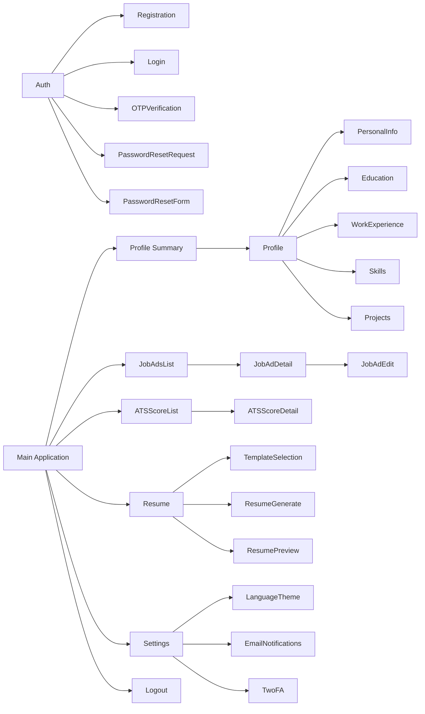
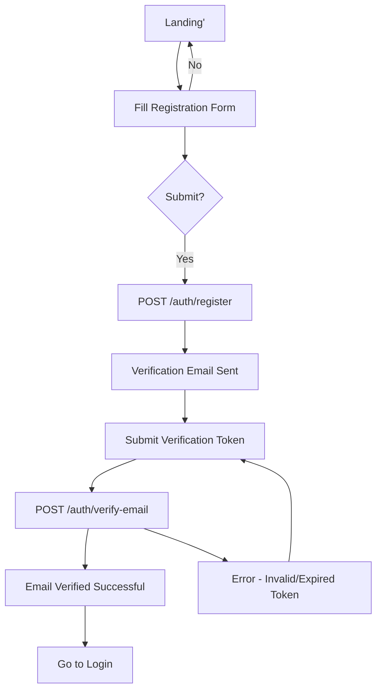
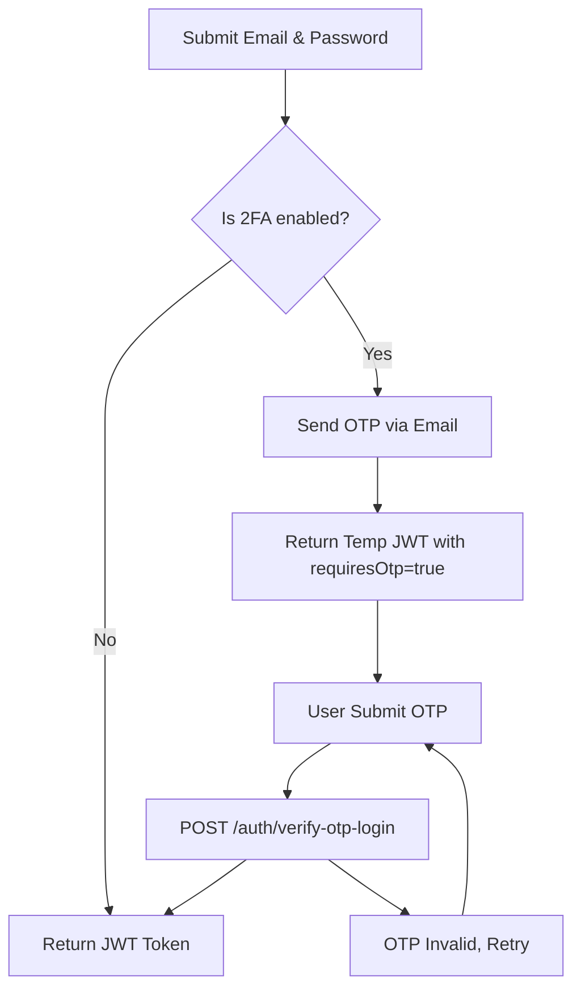
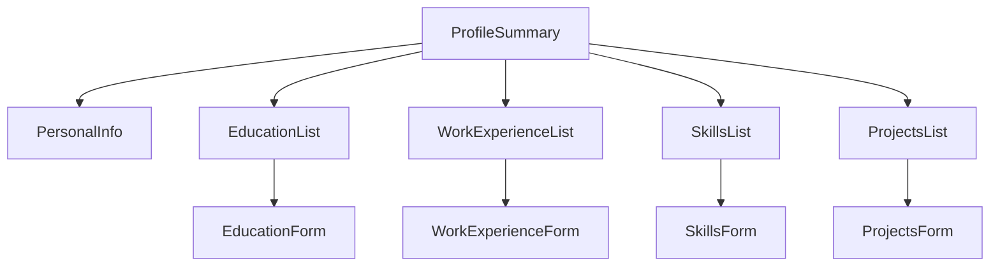
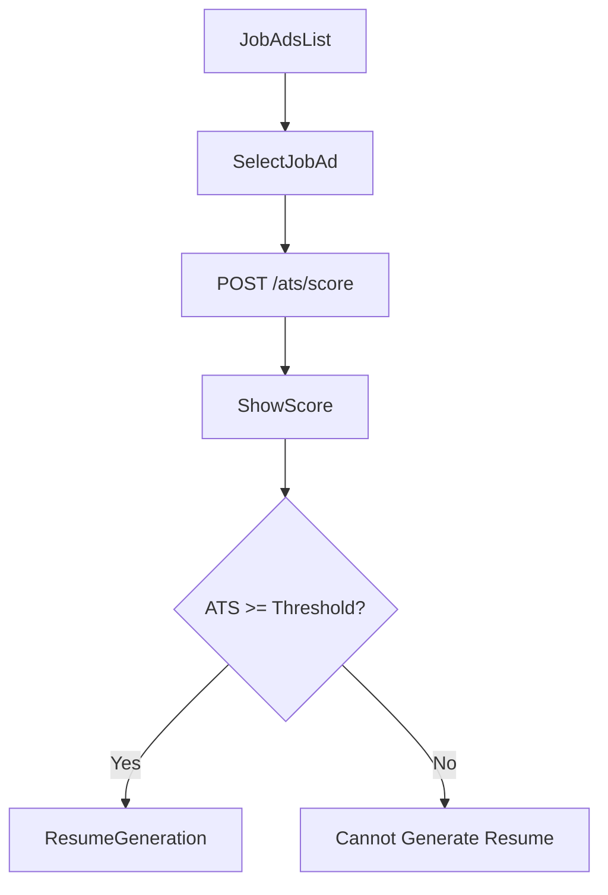
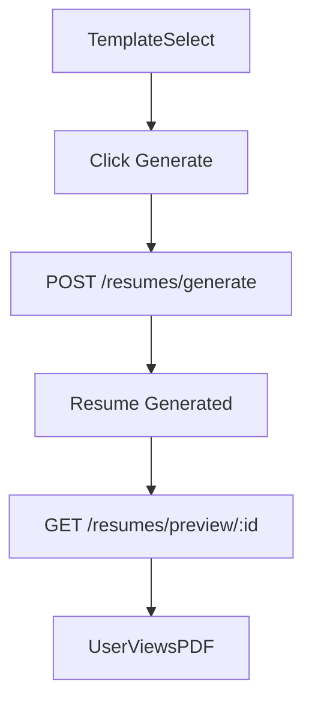
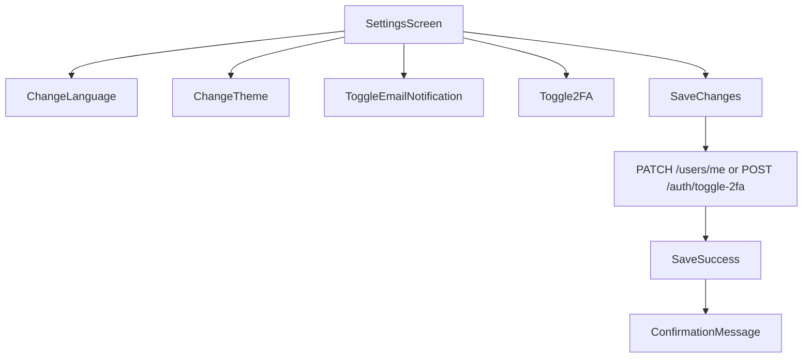

# Corporate Growth Application — Frontend Experience Design Document

---

## 1. Application Structure

### Main Modules

1. **Authentication & Account Management**
   - Register, login with 2FA, email verification, password reset, logout.
2. **Profile Management**
   - Personal details, education, work experience, skills, projects.
3. **Job Advertisements Management**
   - CRUD job ads relevant to the user.
4. **ATS Scoring & Recommendations**
   - Request and display ATS compatibility score and improvement suggestions.
5. **Resume Generation**
   - Select templates, generate, preview, and download resumes.
6. **Account Settings**
   - Language preference, theme preference (light/dark), email notifications, 2FA toggle.
7. **Notifications**
   - No direct screens; handled via email.
8. **Infrastructure & Support**
   - Error boundaries, loading states, accessibility utilities, language/theme toggles.

---

### Navigation Hierarchy & Menu Structure

Assuming a **responsive Sidebar Navigation** for desktop, with a Hamburger menu that collapses on mobile.

```
+---------------------------+
| Header (Top Bar)          |
| - Logo                   |
| - Language switch         |
| - Theme switch            |
| - User Profile Menu (logout, settings) |
+---------------------------+

Sidebar Navigation (responsive):

- Dashboard (Landing page or Profile Summary)
- Profile
  - Personal Info
  - Education
  - Work Experience
  - Skills
  - Projects
- Job Advertisements
  - Job Ads List
  - Add New Job Ad
- ATS Scoring
  - Select Job Ad / Score List
- Resume Generation
  - Template Selection
  - Generate Resume
  - Preview Resumes
- Settings
  - Account Settings (Language, Theme, 2FA, Email Notifications)
- Logout (via User Profile Menu)
```

---

### Sitemap Overview



---

## 2. Screen Inventory

| Screen Name                  | Purpose                                           | User Roles    | Main Actions                                        | Information Displayed                                 |
|-----------------------------|-------------------------------------------------|---------------|----------------------------------------------------|-----------------------------------------------------|
| Registration & Email Verification | User creates account and verifies email        | Job Seeker    | Register, Submit verification token, Resend email  | Registration form, verification status, resend UI   |
| Login with 2FA              | Authenticate user, including OTP submission       | Job Seeker    | Login form, Submit OTP                              | Login fields, OTP input, error messages              |
| Password Reset Request      | Allow users to request password reset              | Job Seeker    | Enter email to request reset                        | Email input, success message                          |
| Password Reset Form         | Reset password with valid token                     | Job Seeker    | Enter new password, submit token                    | Password fields, token status                         |
| Profile Summary             | Display user’s profile overview                      | Job Seeker    | Navigate to detail edits                            | Personal info, education summary, work experience, skills, projects |
| Edit Personal Info          | Edit user’s basic details                            | Job Seeker    | Edit fields, Save or Cancel                         | Editable form for name, email, language, theme       |
| Manage Educations           | CRUD user education entries                          | Job Seeker    | Add, edit, delete education entries                 | List of educations, forms for add/edit                |
| Manage Work Experience      | CRUD user work entries                               | Job Seeker    | Add, edit, delete work experience                   | List of jobs, forms                                    |
| Manage Skills              | CRUD user skills                                     | Job Seeker    | Add, edit, delete skills                            | Skill list, forms                                     |
| Manage Projects            | CRUD user projects                                   | Job Seeker    | Add, edit, delete project entries                   | Project list, forms                                  |
| Job Advertisement List      | List all job ads user entered                        | Job Seeker    | View, select to see/edit job ad                      | Job ad list summary                                  |
| Job Advertisement Detail    | View and edit specific job ad                        | Job Seeker    | Edit fields, Save, Delete                           | Full job ad details, editing forms                   |
| ATS Score List              | List job ads with computed ATS scores               | Job Seeker    | View scores, select job ad                          | Job ads with score summary and status                |
| ATS Score Detail & Recommendations | Show score and improvements for a job ad       | Job Seeker    | View score, recommendations                         | Numeric score, list of recommendations                |
| Resume Template Selection   | Choose resume template                               | Job Seeker    | Select template, preview thumbnails                  | List of templates with names, preview teasers       |
| Resume Generation           | Trigger generation of resume PDF                     | Job Seeker    | Generate, cancel, switch template                   | Selection controls, generate button                   |
| Resume Preview             | Preview generated resume PDF                          | Job Seeker    | Download, close preview                             | PDF view or embedded PDF preview                      |
| Account Settings           | Configure language, theme, email notifications, 2FA | Job Seeker    | Toggle preferences, enable/disable 2FA              | Preferences toggles, status messages                  |
| Loading & Error Screens      | Show loaders and error messages                      | All           | N/A                                                | Loading spinners, inline or full-page error feedback |
| Not Found (404)              | Handle invalid URLs                                  | All           | Navigate back or home                               | 404 message with link                                |
| Unauthorized (401)           | Show on failed auth                                  | All           | Retry login or navigate                            | Message, login prompt                                |

---

## 3. Detailed Screen Designs

---

### Registration & Email Verification Screen

**Purpose:**  
Enable new users to register accounts and perform email verification to activate them.

**Primary User Actions:**  
- Fill registration form (name, email, password)  
- Submit registration  
- Submit verification token (link from email)  
- Resend verification email  

**Important Data Displayed:**  
- Registration input fields  
- Verification token input / info  
- Resend email link  
- Success/error messages  

```
+------------------------------------------------------+
| Header - Logo | Language Switch | Theme Switch       |
+------------------------------------------------------+
|                  Registration Form                   |
|  +----------------------------------------------+   |
|  | Name: [______________________________]       |   |
|  | Email: [_____________________________]       |   |
|  | Password: [__________________________]       |   |
|  | [Register Button]                             |   |
|  +----------------------------------------------+   |
|                                                      |
| ------ OR ------                                     |
|                                                      |
|               Email Verification Section             |
|  +----------------------------------------------+   |
|  | Enter Verification Token: [__________]        |   |
|  | [Verify Email Button]                          |   |
|  | [Resend Verification Email] Link               |   |
|  +----------------------------------------------+   |
|                                                      |
| Messages (Error, Success):                            |
| - "Account created. Verify your email."              |
| - "Invalid token."                                    |
+------------------------------------------------------+

Footer: Links to Login page
```

**UI Components Used:**  
- Form inputs (text, password)  
- Buttons (primary, link-style)  
- Inline info/error messages  
- Language & theme switchers  
- Header & footer

**States:**  
- Empty: Blank form  
- Loading: Register or verify button disables with spinner  
- Error: Validation messages near inputs, or global alert  
- Success: Confirmation message displayed

**Responsive Behavior:**  
- Forms stacked vertically  
- Sidebar replaced by top nav or hamburger menu on mobile  
- Buttons and inputs scale for tap targets

**Accessibility:**  
- Proper labels linked to inputs  
- Keyboard tabbable  
- ARIA live regions for messages  
- High contrast mode for themes

---

### Login and 2FA Screen

**Purpose:**  
Authenticate users by credentials and complete 2FA OTP if enabled.

**Primary User Actions:**  
- Enter email and password  
- Submit login  
- Input OTP if requested  
- Submit OTP  

**Important Data Displayed:**  
- Login input fields  
- OTP input field and instructions (if required)  
- 2FA resend/cancel options  
- Error messages  

```
+------------------------------------------------------+
| Header                                               |
+------------------------------------------------------+
|                     Login Form                       |
|  +----------------------------------------------+   |
|  | Email: [_____________________________]       |   |
|  | Password: [__________________________]       |   |
|  | [Login Button]                               |   |
|  +----------------------------------------------+   |
|                                                      |
|           --- OR IF 2FA REQUIRED ---                 |
|                                                      |
|  +----------------------------------------------+   |
|  | Enter 2FA OTP: [__________]                    |   |
|  | [Submit OTP Button]                            |   |
|  | [Resend OTP] Link                              |   |
|  +----------------------------------------------+   |
|                                                      |
| Messages (Error, Success)                             |
+------------------------------------------------------+

Footer: Links to Register, Forgot Password
```

**UI Components Used:**  
- Form inputs  
- Buttons  
- Links  
- Notification banners for errors and info

**States:**  
- Idle, loading, errors  
- OTP resend cooldown display  
- Success redirects user to dashboard  

**Responsive Behavior:**  
- Inputs and buttons sized for mobile  
- Vertical stacking

**Accessibility:**  
- Clear instructions for OTP entry  
- Appropriate ARIA labels and roles  

---

### Profile Summary Screen

**Purpose:**  
Show user a dashboard summary of their profile data.

**Primary User Actions:**  
- Navigate to edit personal info, education, work, skills, projects  
- Navigate to ATS scoring, job ads, resume generation  

**Important Data Displayed:**  
- User name, email  
- Summary cards or lists for:  
  - Education (latest entries)  
  - Work experience  
  - Skills  
  - Projects  

```
+------------------------------------------------------+
| Header + Sidebar                                     |
+------------------------------------------------------+
| Dashboard - Profile Summary                          |
| +----------------+  +----------------+             |
| | Personal Info  |  | Education      | (Preview list)|
| | Name: John Doe |  | XYZ University | - Degree     |
| | Email: ...    |  +----------------+ [Edit Link]  |
| +----------------+                                   |
|                                                      |
| +----------------+  +----------------+             |
| | Work Experience|  | Skills         | (Tag list)   |
| | Company ABC    |  | Java, SQL, ... | [Edit Link]  |
| +----------------+  +----------------+             |
|                                                      |
| +----------------+                                   |
| | Projects       | List recent projects               |
| +----------------+                                   |
|                                                      |
| [Edit Profile Button] [Manage Job Ads] [ATS Score]  |
| [Generate Resume]                                    |
+------------------------------------------------------+
```

**UI Components Used:**  
- Cards  
- Lists  
- Buttons/links  
- Sidebar navigation  

**States:**  
- Empty states show encouraging messages (e.g., "Add your first education.")  

**Responsive Behavior:**  
- Sidebar collapses on mobile, content stacks vertically  

**Accessibility:**  
- Semantic sectioning  
- Keyboard navigation for lists and links  

---

### Education Management Screen

**Purpose:**  
Allow users to add, edit, and delete education entries.

**Primary User Actions:**  
- View list of education entries  
- Add new education  
- Edit existing education  
- Delete education  

**Important Data Displayed:**  
- Table or card list of education entries with key info (institution, degree, dates)  
- Editable form for entry details  

```
+------------------------------------------------------+
| Header + Sidebar                                     |
+------------------------------------------------------+
| Education Management                                 |
| +----------------------------------------------+   |
| | Education List                                |   |
| |------------------------------------------------|
| | Institution       | Degree      | Dates      |   |
| | XYZ University    | BSc CS      | 2015-2019  |   |
| | ABC College       | Diploma     | 2010-2012  |   |
| |---------------------------------------------|   |
| | [Edit] [Delete] buttons per row              |   |
| +----------------------------------------------+   |
|                                                      |
| [Add New Education Button]                            |
|                                                      |
| +----------------------------+                        |
| | Add/Edit Education Form    |                        |
| | Institution: [__________]  |                        |
| | Degree: [__________]       |                        |
| | Field of Study: [_______]  |                        |
| | Start Date: [_____]        |                        |
| | End Date: [_____]          |                        |
| | Description: [____________]|                        |
| | [Save] [Cancel]            |                        |
| +----------------------------+                        |
+------------------------------------------------------+
```

**UI Components Used:**  
- Data table or list  
- Modal or inline form for add/edit  
- Buttons with confirmation dialogs for deletion  

**States:**  
- Empty: "No education entries found. Add your first."  
- Loading on form submit  
- Error feedback inline on validation errors  
- Success toast/snackbar notifications  

**Responsive Behavior:**  
- On mobile, lists become vertically stacked cards  
- Form adapts for small screen inputs  

**Accessibility:**  
- Forms with proper labels  
- Focus management on add/edit modals  
- Confirmation dialogs prompt user before deletion  

---

### Job Advertisement List Screen

**Purpose:**  
Display user’s saved job ads with options to add, edit, delete.

**Primary User Actions:**  
- View all job ads  
- Add new job ad  
- Edit/delete existing job ads  

**Information Displayed:**  
- Job title, location, date created, language  

```
+------------------------------------------------------+
| Header + Sidebar                                     |
+------------------------------------------------------+
| Job Advertisements                                  |
| +----------------------------------------------+   |
| | Search Bar                                    |   |
| | [Add New Job Ad Button]                        |   |
| +----------------------------------------------+   |
| | Job Title       | Location    | Language | Actions |   |
| | Software Engg   | Mumbai      | English  | Edit/Delete |
| | Analyst         | Delhi       | Hindi    | Edit/Delete |
| |---------------------------------------------|   |
+------------------------------------------------------+
```

**UI Components Used:**  
- Search bar (optional)  
- Data table or list  
- Action buttons per row  
- Pagination or infinite scroll if many entries  

**States:**  
- Empty: "No job ads found. Add your first."  
- Error/loading for data fetch  

**Responsive Behavior:**  
- On mobile, rows stack vertically with actions below data  

**Accessibility:**  
- Keyboard accessible action buttons  
- Screen reader announces table headers  

---

### ATS Score Detail Screen

**Purpose:**  
Display ATS compatibility score and actionable recommendations for a selected job ad.

**Primary User Actions:**  
- View ATS score  
- Read improvement suggestions (skills/projects to add)  
- Navigate back to job ad or profile editing  

**Important Data Displayed:**  
- Job ad title and summary  
- ATS numeric score, e.g., 78/100 or 78%  
- List of recommendations with type and description  
- Indicator if resume generation allowed (meets threshold)  

```
+------------------------------------------------------+
| Header + Sidebar                                     |
+------------------------------------------------------+
| ATS Scoring Result                                  |
| Job Ad: Software Engineer - XYZ Corp               |
|                                                     |
| ATS Score: [ 78 / 100 ]                             |
| Progress Bar: [██████████░░░░░░░░░░░░░░░░░░░░]     |
|                                                     |
| Recommendations:                                    |
| 1. Add Skill: "ReactJS"                             |
| 2. Add Project: "Open-source contribution XYZ"    |
|                                                     |
| [Generate Resume Button] (enabled if score >= 70)  |
+------------------------------------------------------+
```

**UI Components Used:**  
- Progress bar or score badge  
- List with icons or badges for recommendation types  
- Button (enabled/disabled based on threshold)  

**States:**  
- Loading (spinner while fetching score)  
- Error if score unavailable  
- Empty recommendations message if none  

**Responsive Behavior:**  
- Score and recommendations stack vertically on small screens  

**Accessibility:**  
- Semantic headings and lists  
- Clear color contrast for progress bars and badges  

---

### Resume Templates Selection Screen

**Purpose:**  
Allow users to select from multiple resume templates before generation.

**Primary User Actions:**  
- Browse available templates  
- Preview a template  
- Select one for use  

**Data Displayed:**  
- Template name and language  
- Active/inactive status  
- Thumbnail preview  

```
+------------------------------------------------------+
| Header + Sidebar                                     |
+------------------------------------------------------+
| Select Resume Template                              |
| +----------------------------------------------+   |
| | Template Card Grid                             |  |
| | +-----------------+  +-----------------+     |  |
| | | Template 1      |  | Template 2      |     |  |
| | | [Thumbnail img] |  | [Thumbnail img] |     |  |
| | | Name: Classic   |  | Name: Modern    |     |  |
| | | Language: EN    |  | Language: EN    |     |  |
| | | [Preview][Select] | [Preview][Select]     |  |
| +----------------------------------------------+   |
+------------------------------------------------------+
```

**UI Components Used:**  
- Card grid with image previews  
- Buttons for preview/select  
- Pagination if needed  

**States:**  
- Loading templates  
- Disabled templates (if inactive)  
- No templates found message  

**Responsive Behavior:**  
- Cards stack on narrow screens  

**Accessibility:**  
- Labels on preview buttons  
- Keyboard focus on cards  
- ARIA roles for grid/presentation  

---

### Resume Generation Screen

**Purpose:**  
Trigger resume generation for selected job ad and template; show progress and result.

**Primary User Actions:**  
- Confirm generation  
- Cancel generation (if async)  
- Access preview/download  

**Data Displayed:**  
- Selected job ad and template  
- ATS score validation (must meet threshold)  
- Generation status and progress  

```
+------------------------------------------------------+
| Header + Sidebar                                     |
+------------------------------------------------------+
| Resume Generation                                  |
| Job Ad: Software Engineer - XYZ                    |
| Template: Modern Classic                            |
| ATS Score: 78 (Threshold: 70)                       |
|                                                     |
| [Generate Resume]                                   |
|                                                     |
| Generation Progress: [loading spinner or progress]  |
|                                                     |
| [Preview Resume] (enabled after generation)         |
|                                                     |
| Messages:                                           |
| - Error if ATS score below threshold                |
| - Success confirmation                               |
+------------------------------------------------------+
```

**UI Components Used:**  
- Informational text and badges  
- Buttons  
- Loading indicator  

**States:**  
- Idle  
- Generating (loading spinner)  
- Success with preview link  
- Error (score too low etc.)  

**Responsive Behavior:**  
- Stack layout for small screens  

**Accessibility:**  
- Clear focus on actionable buttons  
- ARIA alerts for status  

---

### Resume Preview Screen

**Purpose:**  
Allow users to view and download their generated resume PDF.

**Primary User Actions:**  
- View embedded PDF preview  
- Download PDF file  
- Close preview  

**Data Displayed:**  
- PDF document embedded or iframe  
- Download button  

```
+------------------------------------------------------+
| Header                                               |
+------------------------------------------------------+
| Resume Preview                                      |
| +------------------------------------------------+ |
| | [Embedded PDF viewer or placeholder]           | |
| |                                                | |
| +------------------------------------------------+ |
|                                                     |
| [Download] [Close]                                  |
+------------------------------------------------------+
```

**UI Components Used:**  
- PDF viewer (embedded) or iframe  
- Buttons for download/close  

**States:**  
- Loading document  
- Error loading PDF  

**Responsive Behavior:**  
- Fullscreen PDF on small devices  
- Scrollable container  

**Accessibility:**  
- Keyboard shortcuts for close  
- Labels for buttons  

---

### Account Settings Screen

**Purpose:**  
Configure preferences: UI language, theme, email notifications, and 2FA toggle.

**Primary User Actions:**  
- Change language (EN / Hindi)  
- Switch theme (light/dark)  
- Enable/disable email notifications  
- Enable/disable 2FA  

**Data Displayed:**  
- Current settings  
- Toggle switches or dropdowns  

```
+------------------------------------------------------+
| Header + Sidebar                                     |
+------------------------------------------------------+
| Account Settings                                   |
| +----------------------------------------------+   |
| | Language: [Dropdown: English / Hindi]         |   |
| | Theme:    [Toggle: Light / Dark]               |   |
| | Email Notifications: [Toggle: On / Off]        |   |
| | Two-Factor Authentication: [Toggle: Enable/Disable] | |
| +----------------------------------------------+   |
|                                                     |
| [Save Changes Button]                                |
+------------------------------------------------------+
```

**UI Components Used:**  
- Dropdowns  
- Toggle switches  
- Buttons  
- Informational text or tooltips (e.g., about 2FA)  

**States:**  
- Loading current preferences  
- Saving state with spinner  
- Success and error feedback  

**Responsive Behavior:**  
- Fields stack vertically on mobile  

**Accessibility:**  
- Labels and roles for toggles  
- Keyboard navigable controls  

---

## 4. Navigation Flows

---

### User Registration & Verification Flow



---

### Login with 2FA Flow



---

### Profile Management Navigation



---

### ATS Scoring & Recommendations



---

### Resume Generation & Preview



---

### Settings Update Flow



---

## 5. Reusable Components

| Component              | Usage Locations                                    | Description / Role                               |
|------------------------|---------------------------------------------------|-------------------------------------------------|
| **Header**             | Across all logged-in pages                         | Displays logo, language switch, theme toggle, user menu |
| **Sidebar Navigation** | Main app layout                                   | Provides navigation through modules              |
| **Buttons**            | Forms, dialogs, all action triggers               | Primary, secondary, disabled styles              |
| **Forms**              | Profile edits, job ads, authentication screens    | Input handling, validation, accessibility        |
| **Modals/Dialog**      | Confirmations (delete), form overlays              | Focus trap, keyboard accessible popups            |
| **Data Tables / Lists**| Job ads, education, skills, projects               | Sortable, paginated, with row actions             |
| **Input Fields**       | Text, date pickers, dropdowns                       | Consistent validations and styles                 |
| **Search Bars**        | Job ads listing, potentially profile skills       | Filtering lists                                   |
| **Progress Bars / Scores**| ATS score display, resume generation progress    | Visual numeric indicators                          |
| **Notification / Toasts**| For success/error/info messages                    | Transient messages for user feedback               |
| **Language Switcher**  | Header and settings                                | Toggle between English/Hindi                       |
| **Theme Switcher**     | Header and settings                                | Toggle light/dark UI                               |
| **Badges / Tags**      | Skills list, recommendations                        | Visual emphasis on types and statuses             |
| **PDF Viewer Component**| Resume preview                                    | Embedded PDF display                               |

---

## 6. Design System Recommendations

### Typography Hierarchy

- **H1:** Main page titles (e.g., Dashboard, Settings) - 28px, Bold  
- **H2:** Section headings (e.g., Education, Job Ads) - 24px, Semibold  
- **H3:** Subsection titles, card titles - 20px, Medium  
- **Body Text:** 16px, Regular  
- **Small text / Captions:** 12-14px, Regular or Italic  

*Use a clean, professional sans-serif font like "Inter", "Roboto", or "Segoe UI".*

---

### Layout Spacing & Grid

- Use a 12-column grid system with 16px gutters.  
- Margins and paddings in increments of 8px (8, 16, 24, 32).  
- Consistent vertical rhythm with 24px line heights for body text.  
- Responsive breakpoints:  
  - Mobile: <600px  
  - Tablet: 600-900px  
  - Desktop: 900px+ (default)  

---

### Form Patterns

- Use labeled inputs aligned left or above fields for mobile.  
- Inline validation with clear error messages.  
- Disabled state styling consistent.  
- Date pickers should use single calendar popups.  
- Multi-part forms minimized; use modal dialogs for add/edit scenarios.  

---

### Table Patterns

- Responsive tables with horizontal scroll on small devices.  
- Sortable columns for job ads and profile lists.  
- Action buttons in last columns with icons and labels.  
- Empty states with calls to action.  

---

### Color Usage

- Primary color: Deep blue or corporate blue variant (for buttons, highlights).  
- Secondary color: Neutral gray tones for backgrounds and borders.  
- Success: Green (#28a745)  
- Error: Red (#dc3545)  
- Warning: Orange (#ffc107)  
- Info: Blue (#17a2b8)  
- Use semantic colors consistently for buttons, alerts, progress bars, badges.

---

### Dark Mode Considerations

- Dark backgrounds: dark gray (#121212)  
- Text: light gray/white (#e0e0e0)  
- Maintain contrast ratio of at least 4.5:1 per WCAG AA.  
- Invert or adjust colors accordingly (e.g., link colors, buttons).  
- Use CSS variables for colors to swap themes efficiently.  
- Preserve accessible focus outlines and hover states for both modes.  

---

### Accessibility

- All interactive elements keyboard operable.  
- ARIA roles and labels where visual meaning is not explicit.  
- Screen reader announcements for form validation, state changes, dialogs.  
- Contrast ratios at least WCAG AA standard (4.5:1 for text).  
- Support for user font size scaling and zoom.

---

## 7. Screen Dependency Matrix

| Screen Name                    | Depends On                         | Navigation Source                         | Navigation Destination               |
|-------------------------------|----------------------------------|------------------------------------------|------------------------------------|
| Registration & Email Verify    | None                             | Public / Landing page                     | Login Screen                       |
| Login & 2FA                   | Registration Screen              | Public / Landing page                     | Dashboard / Profile Summary         |
| Password Reset Request        | Login Screen                    | Login Screen                             | Password Reset Form                 |
| Password Reset Form           | Password Reset Request          | Password Reset Request                     | Login Screen                       |
| Profile Summary              | Authenticated User Data          | Dashboard (post-login), Nav Menu          | Profile Edit Screens (Personal, Education...) |
| Edit Personal Info           | Profile Summary                  | Profile Summary                            | Profile Summary                    |
| Education Management         | Profile Summary                  | Profile Summary                            | Profile Summary                    |
| Work Experience Management   | Profile Summary                  | Profile Summary                            | Profile Summary                    |
| Skills Management            | Profile Summary                  | Profile Summary                            | Profile Summary                    |
| Projects Management          | Profile Summary                  | Profile Summary                            | Profile Summary                    |
| Job Advertisement List       | Authenticated User Data          | Nav Menu, Dashboard                        | Job Advertisement Detail           |
| Job Advertisement Detail/Edit| Job Advertisement List           | Job Advertisement List                     | Job Advertisement List             |
| ATS Score List               | Job Advertisement List            | Nav Menu, Job Advertisement List          | ATS Score Detail                   |
| ATS Score Detail/Recommendation | ATS Score List              | ATS Score List                             | Resume Generation Screen           |
| Resume Template Selection    | ATS Score Detail                 | Nav Menu, ATS Score Detail                  | Resume Generation Screen           |
| Resume Generation Screen     | Resume Template Selection, ATS Score Detail | Resume Template Selection            | Resume Preview Screen              |
| Resume Preview Screen        | Resume Generation Screen          | Resume Generation Screen                    | Resume Generation Screen / Profile Summary |
| Account Settings             | Authenticated User Data           | Nav Menu                                  | Account Settings (same screen)     |

---

## 8. Frontend Development Priority Plan

### Priority Order

1. **Layouts & Global Infrastructure**  
   - Header, Sidebar Navigation, Footer, Theme & Language Providers  
   - Routing setup and internationalization (i18n)  
   - Global error and loading states  

   *Justification:* Foundation for user journey navigation and application responsiveness.

2. **Shared Reusable Components**  
   - Buttons, Forms, Modals, Tables, Inputs, Notifications, Progress Bars, etc.  
   - Dark mode support in components  
   - Accessibility compliance  

   *Justification:* Reusable components reduce duplication, ensure consistency, and speed up feature development.

3. **Authentication Flow Components**  
   - Registration, Login with 2FA, Email Verification, Password Reset  
   - Secure access gating for app  

   *Justification:* Critical path for allowing users to access application; underpins all other flows.

4. **Profile Management Feature Components**  
   - Profile Summary, Personal Info, Education, Work Experience, Skills, Projects  
   - CRUD operations with form validations  

   *Justification:* Core to user data input and ATS scoring; enables meaningful system interaction.

5. **Job Advertisements**  
   - List, Detail, CRUD Forms  
   - Integration points for ATS scoring  

   *Justification:* Required to perform ATS scoring and resume generation.

6. **ATS Scoring Screens & Integration**  
   - Score listing and detailed recommendations  
   - Retry and error states  

   *Justification:* Essential feedback that drives user motivation and resume eligibility.

7. **Resume Generation & Preview**  
   - Template selection UI  
   - Resume generate and preview flows  
   - PDF embedding / download  

   *Justification:* Key output feature to users; dependent on profile and ATS readiness.

8. **Account Settings**  
   - Language, Theme, 2FA toggles, Email notifications  
   - Persist and restore preferences  

   *Justification:* Supports personalization and security settings; lower priority but important.

---

# Summary

This structured frontend design plan organizes the application into logical modules and screens aligned with business and technical requirements. The design focuses on high usability, accessibility, bilingual support, and responsive enterprise-grade patterns. The detailed screen descriptions, navigation flows, reusable components, and system-wide design principles provide a clear reference for frontend implementation in React + TypeScript.

Please advise if you want me to proceed with full user journey storyboards, detailed UI component specs, or prototyping recommendations.