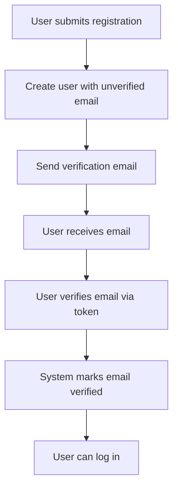
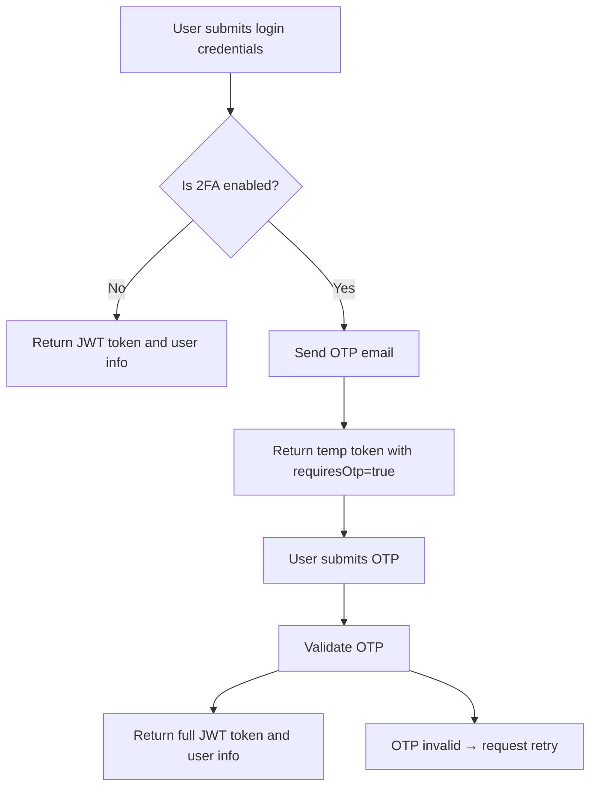
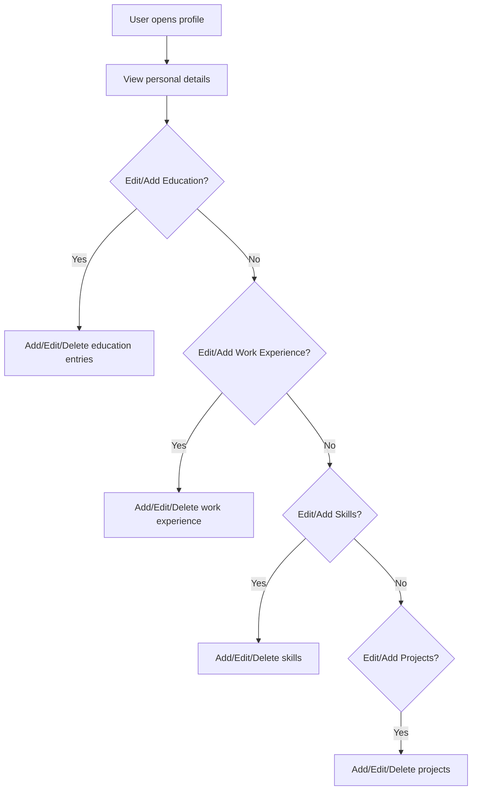
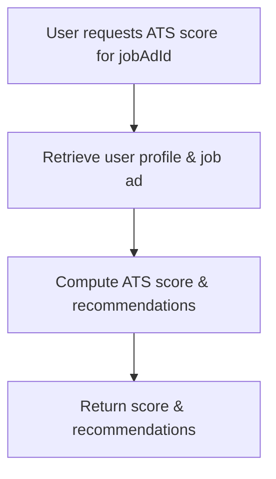
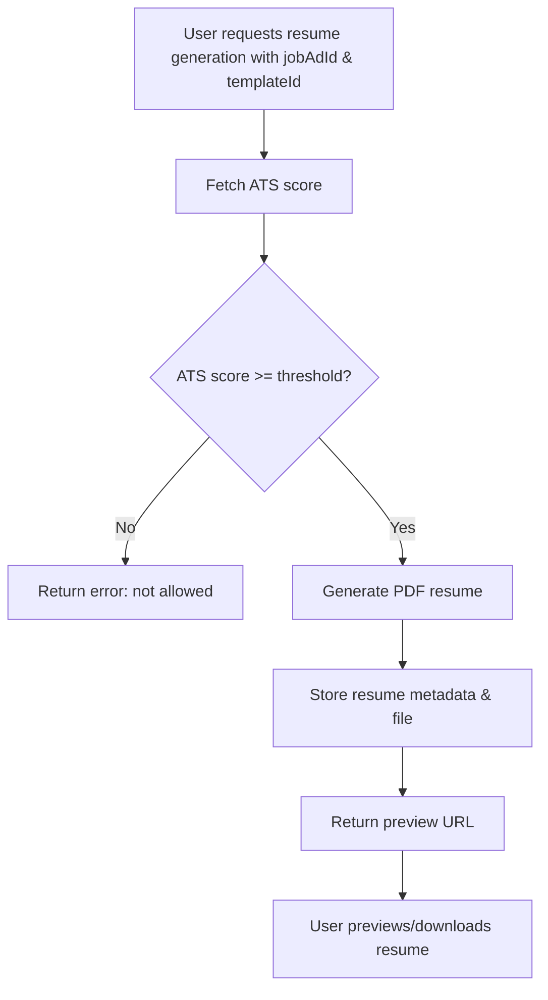

## 1. Application Summary

This application is a corporate growth assistant web platform designed primarily for **Job Seekers** who want to improve their chances of securing jobs by optimally tailoring their profiles and resumes for specific job advertisements.

**What the application does:**

- Allows users to create detailed personal profiles including education, work experience, skills, and projects.
- Enables users to input and manage job advertisements they wish to apply for.
- Computes an **ATS compatibility score** by comparing the user's profile with a job advertisement to quantify fit.
- Provides actionable recommendations (e.g., new skills or projects to add) to improve ATS score.
- Permits generation of custom PDF resumes targeted for job ads when a minimum ATS score threshold is met, using multiple pre-built templates.
- Supports bilingual UI (English and Hindi) and light/dark theme preferences.
- Secures user accounts via email verification, password reset, and mandatory two-factor authentication (2FA).
- Sends email notifications and reminders for account verification, password resets, 2FA codes, profile updates, and job deadlines.
- Exposes a RESTful API backend with modular service design.

**Who uses it:**

- **Job Seekers:** The primary users who manage profiles, input job ads, view scores, receive recommendations, and generate resumes.
- **System (automated processes):** Backend services handle ATS scoring, resume generation, email notifications, and security enforcement automatically.

**Core business objectives:**

- Enhance job seekers' competitiveness by detailed self-assessment against job requirements.
- Provide clear, actionable feedback to improve user profiles.
- Deliver high-quality, customized resumes aligned with specific jobs.
- Ensure account security with strong authentication measures.
- Support accessibility via language and UI theme customization.
- Maintain responsive performance and reliable data persistence.

---

## 2. User Roles

| Role       | Responsibilities                                                       | Permissions                                        | Accessible Features                                       | Typical Tasks                                                                                  |
|------------|------------------------------------------------------------------------|---------------------------------------------------|-----------------------------------------------------------|-----------------------------------------------------------------------------------------------|
| Job Seeker | Manage personal profile, input job ads, view ATS scores, generate resumes, manage settings | Full CRUD on their own profile data and job ads; request ATS scoring; generate resumes if ATS score threshold met; update preferences; enable/disable 2FA | Profile management (personal info, education, work experience, skills, projects); Job advertisement management; ATS score viewing; Recommendations viewing; Resume generation and preview; Account settings; Email notifications | Register and verify account; Add/update/delete profile details and job ads; Request ATS scoring; View score and recommendations; Generate & preview resumes; Manage settings (language, theme, 2FA); Respond to email notifications |
| System (Automated) | Compute ATS scores; generate resume PDFs; send notification emails; enforce security (2FA, token blacklisting) | Internal system privileges; No UI access                       | Automated processes and services                               | Perform ATS calculations; Generate PDFs; Send emails (verification, OTPs, reminders)                                           |

---

## 3. Entity Analysis

| Entity               | Purpose                                                | Attributes (Key fields)                                                                                                                             | Relationships                                                             | Lifecycle States / Transitions                                          |
|----------------------|--------------------------------------------------------|-----------------------------------------------------------------------------------------------------------------------------------------------------|---------------------------------------------------------------------------|------------------------------------------------------------------------|
| User                 | Represents the job seeker user account & preferences   | userId (UUID), name, email, passwordHash, role, isEmailVerified, emailVerificationToken, is2faEnabled, isEmailNotificationsEnabled, languagePreference, themePreference, createdAt, updatedAt | One-to-many: Educations, WorkExperiences, Skills, Projects, JobAdvertisements, AtsScores, GeneratedResumes; One-to-many PasswordResetTokens, UserOtps | Created → Email Verified → Active (enabled 2FA optional) → Updated → Disabled/Deleted (out of scope) |
| PasswordResetToken   | Stores tokens for password reset via email              | id (UUID), userId (FK), token, expiresAt, usedAt, createdAt, updatedAt                                                                              | Many-to-one User                                                          | Created → Used or Expired                                                |
| UserOtp              | Stores OTPs for 2FA and other verification              | id (UUID), userId (FK), otp, type (e.g., 'login_2fa'), expiresAt, usedAt, createdAt, updatedAt                                                      | Many-to-one User                                                          | Created → Used or Expired                                                |
| UserEducation        | Education history for user                               | id, userId, institution, degree, fieldOfStudy, startDate, endDate, description, createdAt, updatedAt                                                 | Many-to-one User                                                          | Created → Updated → Deleted                                             |
| UserWorkExperience   | Work experiences for user                                | id, userId, company, role, startDate, endDate, description, createdAt, updatedAt                                                                    | Many-to-one User                                                          | Created → Updated → Deleted                                             |
| UserSkill            | Skills listed by user                                    | id, userId, skillName, proficiencyLevel, createdAt, updatedAt                                                                                       | Many-to-one User                                                          | Created → Updated → Deleted                                             |
| UserProject          | Projects contributed to by user                          | id, userId, projectName, description, startDate, endDate, techStack, createdAt, updatedAt                                                           | Many-to-one User                                                          | Created → Updated → Deleted                                             |
| JobAdvertisement     | Job ad details entered by user                           | id, userId, title, description, requirements, location (optional), language ('en'/'hi'), createdAt, updatedAt                                        | Many-to-one User; One-to-many AtsScores, GeneratedResumes                 | Created → Updated → Deleted                                             |
| AtsScore             | Cached compatibility score and recommendations          | id, userId, jobAdId, atsScore (0-100), recommendations (JSON), createdAt, updatedAt                                                                 | Many-to-one User; Many-to-one JobAdvertisement                            | Created → Updated → Expired (optional)                                 |
| ResumeTemplate       | Available resume templates                               | id, name, language ('en'/'hi'), isActive, createdAt, updatedAt                                                                                      | None (used by ResumeGeneration)                                           | Created → Activated → Deactivated (inactive)                           |
| GeneratedResume      | Metadata linking generated PDF resume                    | id, userId, jobAdId, resumeTemplateId, atsScore, filePath (URL or path in storage), generatedAt                                                      | Many-to-one User; Many-to-one JobAdvertisement; Many-to-one ResumeTemplate | Created → (Archived or deleted - out of scope)                         |

---

## 4. Workflow Discovery

### Workflow 1: User Registration and Account Verification

- **Purpose:** Enable a user to register an account and verify their email to activate the account.
- **Actors:** Job Seeker (User), System (Email service)
- **Preconditions:** User has access to a valid email.
- **Trigger:** User submits registration form with name, email, password.
- **Steps:**
  1. User calls `POST /api/v1/auth/register` with registration data.
  2. System creates user record with `isEmailVerified = false`.
  3. System generates email verification token and sends verification email.
  4. User receives email and clicks verification link or submits token via `POST /api/v1/auth/verify-email`.
  5. System verifies token; marks `isEmailVerified = true`.
- **Success Outcome:** User has verified account and can log in.
- **Failure Scenarios:** Email token expired or invalid; user attempts login before verification.
- **Business Rules:**
  - Email must be unique.
  - Email verification required to access protected features.
- **Related Entities:** User, PasswordResetToken (for email verification tokens stored in User records).
- **Related APIs:** `/auth/register`, `/auth/verify-email`, `/auth/resend-verification`

---

### Workflow 2: User Authentication with 2FA

- **Purpose:** Authenticate users securely with password and optional 2FA.
- **Actors:** User, System
- **Preconditions:** User has registered and activated account.
- **Trigger:** User submits login credentials.
- **Steps:**
  1. User sends `POST /api/v1/auth/login` with email and password.
  2. System validates credentials; if 2FA disabled, returns JWT token.
  3. If 2FA enabled, sends OTP via email and returns temp JWT token with `requiresOtp=true`.
  4. User submits OTP via `POST /api/v1/auth/verify-otp-login`.
  5. System verifies OTP; returns full JWT token.
- **Success Outcome:** User receives valid JWT for authenticated sessions.
- **Failure Scenarios:** Invalid credentials; incorrect or expired OTP.
- **Business Rules:** 2FA enforced as per user settings; OTP single-use and time-limited.
- **Entities:** User, UserOtp
- **APIs:** `/auth/login`, `/auth/verify-otp-login`

---

### Workflow 3: Password Reset

- **Purpose:** Allow a user to securely reset forgotten password.
- **Actors:** User, System
- **Preconditions:** User has registered with verified email.
- **Trigger:** User requests password reset.
- **Steps:**
  1. User calls `POST /api/v1/auth/forgot-password` with email.
  2. System generates password reset token, stores it, and sends email with reset link.
  3. User clicks link and submits new password with token to `POST /api/v1/auth/reset-password`.
  4. System validates token, sets new password hash in User record, invalidates token.
- **Success Outcome:** User password updated, can log in with new password.
- **Failure Scenarios:** Token expired, invalid, or already used.
- **Business Rules:** Tokens single-use, expire after defined time.
- **Entities:** User, PasswordResetToken
- **APIs:** `/auth/forgot-password`, `/auth/reset-password`

---

### Workflow 4: Profile Management (Add/Edit/Delete Details)

- **Purpose:** Enable users to maintain detailed personal profiles.
- **Actors:** User
- **Preconditions:** Authenticated user (validated JWT and email verified).
- **Trigger:** User selects to add or update profile info.
- **Steps:**
  1. User sends CRUD requests to `/api/v1/users/*` endpoints for:
     - Personal data PATCH `/users/me`
     - Education POST/PATCH/DELETE `/users/educations`
     - Work Experience `/users/work-experiences`
     - Skills `/users/skills`
     - Projects `/users/projects`
  2. System validates data and saves changes.
- **Success Outcome:** Profile data updated, retrievable.
- **Failure Scenarios:** Invalid data, unauthorized access to others’ data.
- **Business Rules:** Users can only CRUD their own profiles.
- **Entities:** User, UserEducation, UserWorkExperience, UserSkill, UserProject
- **APIs:** `/users/me`, `/users/educations`, `/users/work-experiences`, `/users/skills`, `/users/projects`

---

### Workflow 5: Job Advertisement Management

- **Purpose:** Enable users to create and maintain job advertisements they are interested in.
- **Actors:** User
- **Preconditions:** Authenticated user.
- **Trigger:** User inputs or edits a job ad.
- **Steps:**
  1. User sends POST/GET/PATCH/DELETE requests to `/api/v1/job-ads/*`.
  2. System stores job ad including title, description, requirements, language, etc.
- **Success Outcome:** Persistent job ad records for user.
- **Failure Scenarios:** Validation errors; unauthorized update/delete.
- **Business Rules:** Only owner user can CRUD their job ads.
- **Entities:** JobAdvertisement
- **APIs:** `/job-ads`

---

### Workflow 6: ATS Scoring and Recommendations

- **Purpose:** Compute how well user profile fits a given job advertisement and generate improvement suggestions.
- **Actors:** User, System
- **Preconditions:** User has profile and job ad data.
- **Trigger:** User requests ATS scoring for a specific job ad.
- **Steps:**
  1. User issues `POST /api/v1/ats/score` with `jobAdId`.
  2. System retrieves user profile and job ad, runs scoring algorithm.
  3. System returns numeric ATS score (0-100) and actionable recommendations (skills/projects to add).
  4. Optionally, cached score can be fetched by `GET /api/v1/ats/score/:jobAdId`.
- **Success Outcome:** User receives ATS score and feedback.
- **Failure Scenarios:** Missing data; malformed request.
- **Business Rules:** Score computed on-demand or from cache; recommendations tailored.
- **Entities:** AtsScore, User, JobAdvertisement
- **APIs:** `/ats/score`, `/ats/score/:jobAdId`

---

### Workflow 7: Resume Generation and Preview

- **Purpose:** Generate and preview customized PDF resumes when ATS score meets threshold.
- **Actors:** User, System
- **Preconditions:** User has profile, job ad, ATS score ≥ threshold, and selected resume template.
- **Trigger:** User requests resume generation.
- **Steps:**
  1. User requests `POST /api/v1/resumes/generate` with jobAdId, templateId, optional language.
  2. System validates ATS score threshold.
  3. System generates PDF resume combining user data and job ad targeting the template language.
  4. System stores generated resume metadata and file location.
  5. Returns preview ID and URL.
  6. User fetches preview/download via `GET /api/v1/resumes/preview/:previewId`.
- **Success Outcome:** User obtains downloadable resume PDF.
- **Failure Scenarios:** ATS score below threshold; invalid template; generation failure.
- **Business Rules:** Resume generation only allowed if ATS score ≥ configured threshold.
- **Entities:** GeneratedResume, ResumeTemplate, User, JobAdvertisement
- **APIs:** `/resumes/templates`, `/resumes/generate`, `/resumes/preview/:id`

---

### Workflow 8: Account Settings and Preferences Management

- **Purpose:** Allow users to manage UI language, theme, email notifications, and 2FA settings.
- **Actors:** User
- **Preconditions:** Authenticated user.
- **Trigger:** User updates settings.
- **Steps:**
  1. User updates preferences via `PATCH /api/v1/users/me` (language, theme).
  2. User updates email notification preference via `PUT /api/v1/users/me/email-preferences`.
  3. User toggles 2FA via `POST /api/v1/auth/toggle-2fa`.
- **Success Outcome:** Preferences saved and applied.
- **Failure Scenarios:** Invalid preference values.
- **Business Rules:** 2FA toggle affects login flow.
- **Entities:** User (with languagePreference, themePreference, is2faEnabled, isEmailNotificationsEnabled)
- **APIs:** `/users/me`, `/users/me/email-preferences`, `/auth/toggle-2fa`

---

### Workflow 9: Email Notifications and Reminders (Background Process)

- **Purpose:** Notify users via email (verification, password reset, OTPs, reminders).
- **Actors:** System automated services
- **Preconditions:** Users with email notifications enabled.
- **Trigger:** Events such as registration, 2FA, profile updates, job deadlines approaching.
- **Steps:**
  1. Event triggers email sending via Mail Module.
  2. Mail module sends templated email via SMTP.
  3. System logs success or failure.
- **Success Outcome:** User receives timely email notifications.
- **Failure Scenarios:** Email delivery failure (logged, retried).
- **Business Rules:** Respect `isEmailNotificationsEnabled` flag.
- **Entities:** User (email preferences)
- **APIs:** Internal Mail service (no external REST APIs)

---

## 5. User Journeys

### Job Seeker

- **Daily Activities:**
  - Log in with 2FA.
  - Update/add personal profile info (education, skills).
  - Input new job advertisements of interest.
  - Compute ATS score for jobs.
  - Review recommendations to improve profile.
  - Generate and preview resumes for suitable job ads.
  - Adjust UI language and theme preferences.
  - Enable or disable 2FA.
  - Respond to email notifications.

- **Navigation Patterns:**
  - Home/dashboard → Profile → Edit/Add details (multiple tabs or screens).
  - Job Ads List → Job Ad Detail → Request ATS Score → View Recommendations.
  - Resume Templates → Generate Resume → Preview → Download.
  - Settings → Preferences (language, theme, notifications, 2FA).
  - Account → Logout.

- **Typical Sequence:**
  1. Login → Dashboard.
  2. Add/update profile.
  3. Add job ad.
  4. Calculate ATS score for job ad.
  5. View and act on recommendations.
  6. Generate resume if score sufficient.
  7. Configure settings or logout.

- **Pain Points:**
  - Complex profile input forms.
  - Waiting time for ATS scoring or resume generation (needs optimization).
  - Understanding ATS recommendations.
  - Managing 2FA and remembering OTPs.

---

## 6. Workflow Diagrams (Mermaid)

### User Registration and Verification

---

### User Login with 2FA

---

### Profile Management

---

### ATS Scoring Request

---

### Resume Generation

---

## 7. Screen Discovery

| Screen Name                       | Purpose                                              | Primary Actor | Main Actions                                        | Related APIs                               | Related Entities                   |
|---------------------------------|------------------------------------------------------|---------------|----------------------------------------------------|--------------------------------------------|----------------------------------|
| Registration & Email Verification | Account creation and email validation                | Job Seeker    | Register, Submit verification token                | `/auth/register`, `/auth/verify-email`     | User                            |
| Login and 2FA                   | Authenticate user and complete 2FA                   | Job Seeker    | Login, submit OTP                                   | `/auth/login`, `/auth/verify-otp-login`    | User, UserOtp                   |
| Password Reset                 | Request and submit password reset                     | Job Seeker    | Request reset link, submit new password            | `/auth/forgot-password`, `/auth/reset-password` | PasswordResetToken              |
| Profile Summary               | View user's profile summary                            | Job Seeker    | Navigate profile, view personal details            | `/users/me`                                 | User, UserEducation, WorkExperience, UserSkill, UserProject |
| Profile Edit (Personal Info)  | Edit basic personal info                               | Job Seeker    | Edit name, email, language, theme                   | `/users/me`                                | User                            |
| Education Management           | Add/Edit/Delete education entries                      | Job Seeker    | CRUD education records                              | `/users/educations`                         | UserEducation                   |
| Work Experience Management     | Add/Edit/Delete work experience entries                | Job Seeker    | CRUD work experience records                        | `/users/work-experiences`                   | UserWorkExperience              |
| Skills Management              | Add/Edit/Delete skills                                 | Job Seeker    | CRUD skill entries                                  | `/users/skills`                             | UserSkill                      |
| Projects Management            | Add/Edit/Delete projects                               | Job Seeker    | CRUD project entries                                | `/users/projects`                           | UserProject                    |
| Job Advertisement List          | List all user's job ads                                | Job Seeker    | View, select job ad to work with                    | `/job-ads`                                  | JobAdvertisement               |
| Job Advertisement Detail/Edit   | View and edit a specific job advertisement             | Job Seeker    | Edit job ad fields                                  | `/job-ads/:id`                              | JobAdvertisement               |
| ATS Score and Recommendations   | View ATS score and recommended improvements            | Job Seeker    | Request score, view actionable feedback             | `/ats/score`                                | AtsScore, JobAdvertisement, User |
| Resume Templates Selection      | Select resume template for PDF generation               | Job Seeker    | View templates, select one                          | `/resumes/templates`                         | ResumeTemplate                 |
| Resume Generation Screen        | Trigger resume PDF generation and preview              | Job Seeker    | Generate resume, view preview                        | `/resumes/generate`, `/resumes/preview/:id` | GeneratedResume, JobAdvertisement |
| Account Settings               | Manage language, theme, 2FA, and notification prefs    | Job Seeker    | Update preferences, toggle 2FA                      | `/users/me`, `/users/me/email-preferences`, `/auth/toggle-2fa` | User                          |
| Notifications (Emails)          | No UI screen (handled asynchronously)                  | System        | Send emails for various events                      | Internal Mail Module                        | User                          |

---

## 8. Missing Requirements and Clarifications

| Item                     | Description / Question                                                                                           |
|--------------------------|-----------------------------------------------------------------------------------------------------------------|
| ATS Scoring Algorithm     | Detailed logic and weighting for ATS scoring not fully defined - How are profile fields weighted?                |
| ATS Scoring Threshold     | Exact numeric threshold to allow resume generation - configurable or fixed?                                      |
| Recommendation Rules      | Specific rules/criteria to determine which skills or projects to recommend lacking in user profile to improve score? |
| Resume PDF Storage        | Where and how are generated PDFs stored? For how long? Is caching/deletion planned?                             |
| Resume Preview Format     | Is the preview a streamed PDF or rendered image? Web?                                                         |
| Email Notification Opt-out| Is granular opt-out for different email types planned or only global toggle?                                   |
| Two-Factor Authentication| What OTP expiry times and retry limits? Is 2FA mandatory or optional at registration?                           |
| Job Advertisement Parsing | Details about parsing semi-structured text for ATS criteria: Is NLP or rule-based parsing used?                 |
| Profile Data Validation   | Are there restrictions or validation rules for profile fields (e.g., date ranges, text length)?                 |
| Concurrency / Conflicts  | How are concurrent updates managed (e.g., to profile or job ads)?                                               |
| Generated Resume History | Is there a history or versioning needed of generated resumes per user/job?                                     |
| Notification Scheduling   | Are email reminders scheduled on specific times or ad-hoc?                                                     |
| ATS Scores Caching Policy| How often should cached scores be invalidated or recalculated?                                                  |

---

## 9. Frontend Planning Output

| Module               | Workflow                    | Screens Needed                                | APIs Used                                              | Priority    |
|----------------------|-----------------------------|----------------------------------------------|-------------------------------------------------------|-------------|
| Auth                 | Registration & Verification | Registration & Email Verification Screen     | `/auth/register`, `/auth/verify-email`, `/auth/resend-verification` | High        |
| Auth                 | Login with 2FA              | Login Screen, OTP Verification Screen        | `/auth/login`, `/auth/verify-otp-login`                | High        |
| Auth                 | Password Reset              | Forgot Password Screen, Reset Password Screen| `/auth/forgot-password`, `/auth/reset-password`          | Medium      |
| Users                | Profile Management          | Profile Summary, Personal Info Edit, Education, Work Experience, Skills, Projects Screens | `/users/me`, `/users/educations`, `/users/work-experiences`, `/users/skills`, `/users/projects` | High        |
| Job Advertisements    | Job Ad Management           | Job Ads List, Job Ad Detail/Edit Screen      | `/job-ads`                                             | High        |
| ATS Scoring           | ATS Score & Recommendations | ATS Score Display Screen                      | `/ats/score`, `/ats/score/:jobAdId`                    | High        |
| Resume Generation     | Resume Generation           | Resume Templates Selection, Resume Generation & Preview Screens | `/resumes/templates`, `/resumes/generate`, `/resumes/preview/:id` | High        |
| Users                | Settings                   | Account Settings Screen (language, theme, notifications, 2FA) | `/users/me`, `/users/me/email-preferences`, `/auth/toggle-2fa` | Medium      |

---

# Summary

The delivered documentation provides a comprehensive blueprint to build a secure, multilingual, and user-friendly ATS compatibility and resume generation application for Job Seekers. The modular design and entity models facilitate extensibility. To proceed efficiently with frontend UI development and integration, clarifications on ATS scoring algorithms, precise business rules for recommendations, and resume generation nuances should be sought early.

Please advise if you want me to proceed with detailed user stories, sequence diagrams, or breakdown by frontend components next.